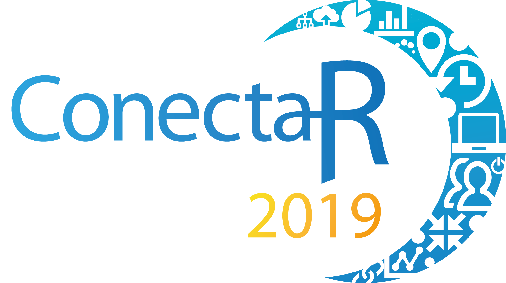

```{r setup, include=FALSE}
options(htmltools.dir.version = FALSE)
library(tidyverse)
library("tm")
library("wordcloud")
library("RColorBrewer")
library("rgdal")
library("cartography")
```




San José, Costa Rica

Del 24 al 26 de enero del 2019

---
class: inverse, center, middle

# Detalles del evento

---

# En cifras [personas]

- **130** personas inscritas: 
  - **26** estudiantes de la Escuela de Estadística
  - **4** docentes: **ninguno** de Asamblea de Escuela
- Presentaciones:
  - **17** personas que presentaron carteles (**10** estudiantes de grado y posgrado de Estadística)
  - **14** personas con charlas contribuidas (**1** profesor de posgrado y **1** ex-alumno de la Escuela)
  - **4** personas en el foro 
  - **4** charlistas invitados (**2** presenciales y **2** virtuales)
  - **4** instructoras de talleres
- Organización:
  - **26** miembros del comité científico (**3** profesores de Estadística)
  - **4** miembros del comité organizador
  - **20** estudiantes UCR voluntarios (**8** estudiantes de grado de Estadística)

---

# En cifras [personas]

```{r echo=FALSE, warning=FALSE, include=FALSE}
a<-c("Chile", "Netherlands", "France", "Peru", "Colombia", "Costa Rica", "Spain",
     "Mexico", "Uruguay", "Argentina", "Dominican Republic", "Guatemala", "United States")

my_spdf=readOGR( dsn= getwd() , layer="TM_WORLD_BORDERS_SIMPL-0.3")
my_spdf$NAME[which(my_spdf$NAME%in%a)]
my_spdf$Asistentes <- as.numeric(my_spdf$NAME%in%a)
```


```{r echo=FALSE, warning=FALSE, out.width='100%', fig.height=5}
choroLayer(spdf = my_spdf, df = my_spdf@data, var = "Asistentes", col=c("#FFFFFF","#135D89"), legend.pos="n")
title("Países con Representantes en ConectaR 2019")
```

---

# En cifras [dinero]

- **8** empresas patrocinadoras $5600
- **5** organizaciones en comité coordinador:
  - Observatorio del Desarrollo - horas asistente, divulgación, contenido, plataforma financiera.
  - Escuela de Estadística - almuerzos, tiempo asignado: apoyo administraivo, divulgación, contenido, atracción de patrocinadores.
  - ixpantia - apoyo administrativo, atracción de patrocinadores, divulgación, contenido, página web espejo.
  - Centro de Investigación en Matemática Pura y Aplicada - apoyo administrativo, página web.
  - Bioversity International - divulgación, contenido.
- Respaldo de R consortium $400
- Gastos:
  - Alimentación (brindis y refrigerios) 
  - Hospedaje y viáticos de visitantes 
  - Materiales de la conferencia 
  - Otros
  
---

# Descripción de la actividad

```{r out.width='100%', fig.height=5, eval=require('leaflet')}
library(leaflet)
leaflet() %>% addTiles() %>% setView(-84.0470, 9.9370, zoom = 17)
```


---

# Descripción de la actividad

```{r echo=FALSE}
agenda <- cbind(
  c("Edgar Ruiz", "RStudio", "Keynote - R y Spark para la Ciencia de Datos"),
                c("Maikol Solís", "CIMPA UCR", "Índices de sensibilidad geométricos basados en construcciones homológicas en variedades"),
                c("Guillermo Durán", "CIGEFI UCR", "Visualización de datos de climáticos a través de herramientas interactivas: experiencias en la Región Chorotega"),
                c("Alfonso Rojas", "University of Texas at Austin",
"PRETIL: Estimación de probabilidades para el mundial Rusia, 2018"),
c("Valery Zúñiga y Carolina Montoya", "Matemática, UCR", "¿Cómo migrar de Excel a R? Un ejercicio práctico de aplicación en la industria"),
c("Óscar Centeno", "Contraloría General de la República","Proyecciones masivas al presupuesto público institucional de Costa Rica"),
c("Luis Barboza", "CIGRAS, UCR", "Uso de R para mapeo de loci de caracteres cuantitativos en papaya"),
c("Daniel Moreno", "Ing. Industrial, UCR", "Optimización de slotting en almacenes con GA en R"),
c("Maëlle Salmon", "rOpenSci y Locke Data", "Keynote - ROpenSci: Mejores paquetes de R, mejor ciencia"),
c("Guillermo Arroyo","EmpowerData México", "Evaluación de Impacto para el Taller Saber para Decidir. Propensity Matching Score"),
c("Robert Hijmans", "UC Davis", "Keynote - La Ciencia de Datos con R"),
c("Nelson Venegas", "CIGEFI, UCR", "Usando R para la evaluación espacio-temporal de productos globales de precipitación con estaciones meteorológicas en Costa Rica"),
c("Gabriel Cordero", "Danta Analytics", "Pronósticos a escala utilizando Alteryx + R - Un caso de integración entre ambas herramientas"),
c("Isabel Quintas", "Universidad Autónoma Metropolitana, México", "Las funciones y el cálculo: ¿y por qué no usar R para visualizar interactivamente?"),
c("Diego May, Alexia Pacheco, Alvaro Pabón, Jacob van Etten","ixpantia, ICE, Finsocial Colombia, Bioversity International",
"Conectando iniciativas de innovación con datos en Latinoamérica con R"),
c("Antonio Vasquez", "UBA, Argentina", "Keynote - Analítica Urbana: Usando R y Open Data para entender nuestras ciudades"),
c("Frans van Dunné","ixpantia","Taller 1 - Crear API's con código R usando plumber"),
c("Natalia da Silva", "Universidad de la República, Uruguay", "Taller 2 - Documentos dinámicos, trabajo colaborativo y control de versiones con Rmarkdown y GitHub"),
c("Riva Quiroga","Pontificia Universidad Católica de Chile","Taller 3 - Análisis de texto"),
c("Ignacio Álvarez-Castro","Universidad de la República, Uruguay","Taller 4 - Introducción al análisis Bayesiano con aplicaciones en STAN")
)

agenda <- data.frame(t(agenda))
names(agenda) <- c("Nombre", "Afiliación", "Charla")
```


```{r eval=require('DT'), tidy=FALSE, echo=FALSE}
DT::datatable(
  agenda,
  fillContainer = FALSE, options = list(pageLength = 3)
)
```

---
class: inverse, center, middle

# Evaluación del evento

---

# Evaluación por parte de los asistentes

```{r echo=FALSE}
ratings <- 
rbind(  
c("La calidad de los expositores y sus intervenciones",	75,	4.3,	4.0,	0.6),
c("Temas de investigación reciente",	75,	4.5,	5.0,	0.7),
c("Cumplimiento del cronograma",	75,	4.8,	5.0,	0.4),
c("Rigor en los horarios",	75,	4.9,	5.0,	0.4),
c("Espacio físico",	75,	4.9,	5.0,	0.3),
c("Organización de las actividades",	75,	4.8,	5.0,	0.6),
c("Señal de internet",	75,	4.3,	5.0,	0.9),
c("Señalización e indicaciones",	75,	4.4,	5.0,	0.9),
c("Accesibilidad al lugar",	75,	4.3,	5.0,	0.8),
c("Proceso de inscripción",	75,	4.7,	5.0,	0.6),
c("Disponibilidad de la información",	75,	4.5,	5.0,	0.7),
c("Entrega de documentos y certificados",	75,	4.5,	5.0,	0.8),
c("Apoyo de la organización",	75,	4.9,	5.0,	0.4),
c('Apoyo de los estudiantes',	75,	4.8,	5.0,	0.5),
c("Equipo audiovisual",	75,	4.7,	5.0,	0.5),
c("Costo de la inscripción",	75,	4.3,	5.0,	0.8),
c("Calidad del servicio refrigerio",	75,	4.8,	5.0,	0.5),
c("Calidad de los alimentos refrigerio",	75,	4.6,	5.0,	0.7),
c("Calidad del servicio almuerzo",	75,	4.8,	5.0,	0.4),
c("Calidad de los alimentos almuerzo",	75,	4.7,	5.0,	0.5),
c("Calidad del servicio brindis",	75,	4.8,	5.0,	0.5),
c("Calidad de los alimentos brindis",	75,	4.8,	5.0,	0.5),
c("Organización de la actividad brindis",	75,	4.7,	5.0,	0.6),
c("Calificación General",	75,	4.8,	5.0,	0.4))

ratings <- data.frame(ratings)
names(ratings) <- c("Pregunta","n"	,"Media", 	"Mediana"	,"SD")
```


```{r eval=require('DT'), tidy=FALSE, echo=FALSE}
DT::datatable(
  ratings,
  fillContainer = FALSE, options = list(pageLength = 8)
)
```

---

# Comentarios

```{r echo=FALSE, warnings=FALSE, include=FALSE}
comments <- 
list("Muy bueno el evento y bien organizado.","Muy motivador para aprender cosas nuevas en R de todas las areas","En el precio de la entrada marqué la opción de excelente, pese a que la escuela me dio beca para asistir al evento por los expositores, los temas y el servicio me parece que el precio está excelente.","En este tipo de evento se debe mejorar la forma en la que los expositores presentan. Así mismo, es más valioso hacer talleres de trabajo (como los del sábado) que tanta exposición.","Muchas gracias por el conocimiento compartido.","Excelente. Se nota que el comité organizador dedicó mucho tiempo y esfuerzo en planear este evento. He disfrutado mucho de las charlas, siento que hay unas que fueron con un enfoque muy específico de su área de estudio por lo que no fue tan sencillo comprenderlas pero el resto gab estado excelente. La feria de empleo estuvo muy bien, me gustaron las opciones de empresas presentes. Espero con ansias la próxima edición de ConectaR.","Promover la realización de preguntas luego de cada presentación. Me parece que muchas personas (en especial estudiantes) no hacen preguntas por creer que son muy básicas, pero sería bueno hacerles entender que toda pregunta es bienvenida y que la idea es aprender cómo se aplican los temas vistos. En general una actividad excelente, muy bien organizada.","Muy buen evento y la organización fue excelente para ser el primero de este tipo en Costa Rica. Espero poder atender en el 2021","Por favor, que los expositores no solo sean buenos matemáticos si no también excelentes comunicadores y pondría como prioridad esta última.","Tratar de mantener la actividad en solo piso todo","Mejor no utilizar recipientes plásticos para los refrigerios","Me gustó el evento, los felicito, gracias! Tal vez para la próxima tomar en cuenta el orden de las banderas en el escenario (dejaron la de Argentina ahí) ... excelente que fueran puntuales siguiendo el cronograma.","Imagino que tuvo que ver con la cantidad de propuestas, pero me hubiera gustado mayor igualdad en el género de los expositores de las ponencias. Los talleres fueron de alta calidad (participé de los de Frans y Riva). El ambiente fue excelente y la organización se preocupó por muchísimos detalles. Se disfrutó mucho.","Incentivar la participación de más mujeres y minorías como conferencistas invitadas y en exposiciones orales. Mayor difusión del evento para que participen otros países.","Algunos posters eran muy buenos y de mayor calidad que algunas exposiciones. Quizás los mejores posters puedan exponer también en el auditorio.",
"Excelente! La organización estuvo muy bien. En algunas presentaciones hizo falta un poco más de R y se volvían muy técnicas (ej: Maikol Solís y la de la papaya), ellos hubieran hablado de cómo usaron R y los desafíos que enfrentaron. Para hacerlo un poco más general y que incluyera a todo mundo. Mostrar código! Es interesante y enriquecedor ojear código ajeno. Además hubiera sido interesante un espacio para que la gente interesada en academia discutiera y la escuela de estadística de la UCR mostrará sus avances en R y cómo pretenden adaptarse.","Una nota en la página de la UCR mencionaba a la UCR como cuna de la ciencia de datos, a mí me pareció engañoso.","Sería interesante escuchar charlas que demuestren el uso de R para la creación de un producto o una herramienta de uso constante. Más allá de una herramienta para solucionar problemas PUNTUALES, es decir no demostrar solo como analizar los datos de una tesis sino demostrar cómo se analizan datos de cierto tipo que van en aumento cada vez dado a necesidades de un negocio particular.","Algunos temas eran muy específicos para la comunidad académica. Las charlas a distancia tenían bien contenido, pero eran difíciles de seguir en este formato.","Toda la organización se vio reflejada en el éxito del congreso. Un evento definitivamente provechoso para quienes empiezan a utilizar R como herramienta en su trabajo, así como para quienes son avanzados en su aplicación. Creo que algo importante sería poder habilitar el acceso a las presentaciones del día del evento. Y por último, los talleres fueron de calidad, aunque hubiese sido excelente contar con más tiempo o con más sesiones.","Mucho carbohidrato en los cafés.","Algunos expositores mostraron solamente los resultados de sus proyectos, lo cual es muy valioso pero a mi me interesaba ver que paquetes y como los usaron, fui al congreso a ver que había novedoso. Igualmente hubieron charlas increíbles como la de rOpenSci o Sparkyr","Solicitar a los y las expositoras que compartan más sobre el código y herramientas utilizadas desde R..., qué tips encontraron a la hora de programar una tarea particular, etc","Algunas ponencias que no se realizaron nunca se informó que no se iban a presentar. Algunos temas de las ponencias no eran tan relevantes en el uso de R y en otras sí. Con respecto a la realización de los talleres me pareció genial, los y las instructores muy buenos. La iniciativa de la actividad es importante para la comunidad R espero se siga realizando.","faltaban señales para encontrar el edificio","Un evento excelente, de muy alta calidad, felicitaciones a los organizadores, fue maravilloso.
Y en comparación con otros eventos similares a los que he asistido queda muy por encima, excelente.")

comments <- Corpus(VectorSource(comments)) 
toSpace <- content_transformer(function (x , pattern ) gsub(pattern, " ", x))
comments <- tm_map(comments, toSpace, "/")
comments <- tm_map(comments, toSpace, "@")
comments <- tm_map(comments, toSpace, "\\|")

#Convert the text to lower case
comments <- tm_map(comments, content_transformer(tolower))
# Remove numbers
comments <- tm_map(comments, removeNumbers)
# Remove english common stopwords
comments <- tm_map(comments, removeWords, stopwords("spanish"))
# Remove your own stop word
# specify your stopwords as a character vector
comments <- tm_map(comments, removeWords, c("cómo", "blabla2")) 
# Remove punctuations
comments <- tm_map(comments, removePunctuation)
# Eliminate extra white spaces
comments <- tm_map(comments, stripWhitespace)
# Text stemming
# docs <- tm_map(docs, stemDocument)

dtm <- TermDocumentMatrix(comments)
m <- as.matrix(dtm)
v <- sort(rowSums(m),decreasing=TRUE)
d <- data.frame(word = names(v),freq=v)
```


```{r echo=FALSE, out.width='100%', fig.height=5}
set.seed(1234)
wordcloud(words = d$word, freq = d$freq, min.freq = 1,
          max.words=50, random.order=FALSE, rot.per=0.35, 
          colors=brewer.pal(4, "Dark2"))
```


---


# Puntos a mejorar por parte de la organización

- Organización de la Feria de Empleo. 
- Mejor difusión entre contactos de Centroamérica, debido a la poca presencia de los vecinos.
- Mejorar el proceso de revisión de propuestas (previendo un aumento de las mismas).
- Mejorar la representatividad de género en la agenda (aunque reconocemos que en esta edición si se hizo el esfuerzo de contactar personalmente a posibles presentadoras, podemos redoblar los esfuerzos en la próxima edición).

---

# Limitaciones y Retos

- Centro de Informática, UCR
  - La sección coordinada por la señora Rebeca Esquivel Flores del Centro de Informática inclumplió con su promesa de ampliar el tiempo para las sesiones de Visitantes y de tratar de aumentar el ancho de banda para el área del evento.
  - Falta de soluciones a problemas de conexión dentro de la Universidad.
  - Es indispensable contar con asesoría y/o disponibilidad para darle certificado de seguridad a las páginas ConectaR de la UCR. En esta edición la falta de certificado causó la falta de acceso a la página desde campus en México, El Salvador y Perú (pueden ser más, pero nos dimos cuenta de estos), además de no estar indexados en las búsquedas de Google.
- OEPI, UCR
  - Nula coordinación para inicio de obras en frente de eventos.
  
---

# Limitaciones y Retos

- Oficina de Becas, UCR
  - Uso del Comedor Estudiantil a pesar de nuestra reserva previa.
- Oficina de Divulgación, UCR
  - Falta de coordinación para la apertura del evento.
  - Fallan los canales de comunicación entre los medios y la ODI.
- UCR en general:
  - Falta de apoyo administrativo directo para eventos.
  - Personal administrativo y docente no cumplen con sus compromisos y tienen cero iniciativa. 
---

class: inverse, center, middle

# Impacto

---

# Colaboraciones como resultado del evento

- Materiales del evento: [Repositorio de materiales](https://github.com/ConectaR2019).
- Escuela de Computación TEC y Estadística para revisión de plan de Ciencia de Datos.
- Ingeniería Industrial y Rladies San José: cursos de R para estudiantes.
- CIGRAS y Estadística para proyectos de tesis de Maestría.
- Presentación de [LatinR](http://latin-r.com/) y de esfuerzo de [traducción](http://es.r4ds.hadley.nz/) comunitarios.
- Nuevas comunidades de usuarios.
- Posible curso de Edgar Ruiz (RStudio) para la Escuela de Estadística.
- [Prensa UCR](https://www.ucr.ac.cr/noticias/2019/01/24/conectar-2019-la-ucr-es-la-casa-del-futuro-de-la-ciencia-de-datos-en-latinoamerica.html) + presencia UCR en la Comunidad de R internacional.
- Colaboraciones para la [traducción de plumber](https://github.com/fontanero-api)
- Entrevistas en Data Latam con: Carolina Montoya y Valery Zúñiga, Alfonso Rojas, y otros por confirmar. 
- Comunicación para colaboraciones con UNA, ITECR, INCAE.


- Otros que no se han concretado aún.

- Y por supuesto: planes para ConectaR 2021

---
class: inverse, center, middle

# Contactos

<a href="https://www.facebook.com/conectar2019/"><i class="fa fa-link fa-fw"></i>&nbsp; https://www.facebook.com/conectar2019/</a><br>
<a href="https://twitter.com/conecta_R"><i class="fa fa-twitter fa-fw"></i>&nbsp; @conecta_R</a><br>
<a href="https://github.com/ConectaR2019"><i class="fa fa-github fa-fw"></i>&nbsp; @ConectaR2019</a><br>

<a href="mailto:conectar@ucr.ac.cr"><i class="fa fa-paper-plane fa-fw"></i>&nbsp; ConectaR - UCR </a><br>

Esta presentación:

https://malfaro2.github.io/ConectaR/informe_EdE.html

---

class: center, middle

# ¡Gracias!

Slides created via the R package [**xaringan**](https://github.com/yihui/xaringan).

The chakra comes from [remark.js](https://remarkjs.com), [**knitr**](http://yihui.name/knitr), and [R Markdown](https://rmarkdown.rstudio.com).
